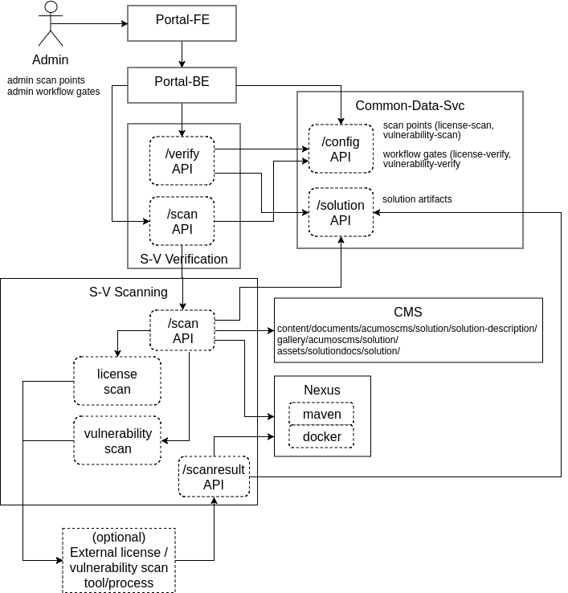

.. ===============LICENSE_START=======================================================
.. Acumos CC-BY-4.0
.. ===================================================================================
.. Copyright (C) 2017-2018 AT&T Intellectual Property & Tech Mahindra. All rights reserved.
.. ===================================================================================
.. This Acumos documentation file is distributed by AT&T and Tech Mahindra
.. under the Creative Commons Attribution 4.0 International License (the "License");
.. you may not use this file except in compliance with the License.
.. You may obtain a copy of the License at
..
.. http://creativecommons.org/licenses/by/4.0
..
.. This file is distributed on an "AS IS" BASIS,
.. See the License for the specific language governing permissions and
.. limitations under the License.
.. ===============LICENSE_END=========================================================

=================================================
Acumos Security-Verification Design Specification
=================================================

This document describes the design for the Acumos platform Security-Verification
component and related capabilities.

-----
Scope
-----

The Security-Verification component (referred to here as S-V) addresses the
following goals of the Acumos project, as outlined by the
`Acumos TSC Security Committee <https://wiki.acumos.org/display/SEC>`_:

* models and related metadata that are contributed to an Acumos platform and
  distributed through a federated ecosystem of Acumos platforms must be
  verified to the extent possible, as

  * contributed under clear and compatible open source license(s)
  * free from security vulnerabilities

............................
Previously Released Features
............................

This is the first release of S-V. The "Validation-Security" component originally
released when the Acumos project was launched, is being superseded by S-V.

........................
Current Release Features
........................

The features planned for delivery in the current release ("Athena") are:

* scanning for license/vulnerability issues in all models and related artifacts
* a default set of open source license/vulnerability scan tools, which can be
  replaced in a "plug and play" manner with tools as preferred by Acumos
  platform operators
* a default set of success criteria for license/vulnerability scans, which can
  be easily customized by Acumos platform operators
* integration of scanning at various points in Acumos platform workflows
* integration of scan result checking gates at various points in Acumos
  platform workflows
* Acumos platform admin control of the scanning and gate check points

  * option to invoke scanning in workflows

    * upon completion of model onboarding
    * upon completion of metadata creation/update, e.g. documents, test data,
      source code archives
    * upon completion of artifact generation
    * upon request to deploy a model to a private or public cloud
    * upon request to download model artifacts or metadata
    * upon request to share a model with another user
    * upon request to publish a model to a company or public marketplace
    * upon request to subscribe to a model published in a federated platform

  * option to define workflow gates that must be passed, in order to allow the
    workflow to be executed, including

    * enable checking prior to workflows

      * deploy a model to private cloud
      * deploy a model to public cloud
      * download a model
      * share a model
      * publish to company marketplace
      * publish to public marketplace
      * subscribe to a model from a federated platform

    * what must have been checked, and what are the acceptable results

      * license scan successful: yes, no (default)
      * vulnerability scan successful: yes, no (default)

The combination of the two admin options enables the platform to support
customization and optimization of S-V processes for an Acumos instance.
For example:

* scans can be invoked as early or as late as desired, in the lifecycle of a
  model, to accommodate local Acumos platform processes or policies
* since "scans" may include offline processes that take time to complete,
  the admin may allow some workflows to be proceed, while others are blocked.
  For example, if licensing has not been verified/approved, the admin may allow
  deployment to a private cloud to publishing to a company marketplace, but not
  deployment to a public cloud or publishing to a public marketplace.
* the Scanning Service will only execute scans as needed for any new/updated
  artifacts/metadata, since a record of earlier scans will be retained as a
  artifact related to the solution.

------------
Architecture
------------

The following diagram illustrates the integration of S-V into an Acumos platform:

.....................
Functional Components
.....................

The S-V service will include two component microservices:

* Verification Service: this is the fontend to the S-V service, which

  * provides all S-V APIs to other Acumos components

    * to serve requests to perform scanning jobs as required (per site admin)
    * to check the status of verification for workflow gates

  * uses CDS site-config data to determine when to invoke scanning
  * uses CDS site-config data and solution data to determine how to respond to
    requests for the status of verification
  * runs as a always-on service under docker-ce or kubernetes

* Scanning Service: this is the backend to the S-V service, which

  * provides a scanning API to the S-V Verification Service, to execute scan
    operations as needed using scanning tools for license and vulnerabilities
  * allows Acumos operators to use a default set of scan tools, or to integrate
    other tools via a plugin-style interface
  * runs as an always-on service under docker, or an on-demand job under
    kubernetes

..........
Interfaces
..........

The S-V service exposes the following APIs.

+++++++++++++++
Scan Invocation
+++++++++++++++

This API enables Acumos components to invoke scanning as needed, based upon
site-config settings that enable scan invocation points in workflows.

The base URL for this API is: http://<verification-service-host>:<port>, where
'verification-service-host' is the routable address of the verification service
in the Acumos platform deployment, and port is the assigned port where the
servce is listening for API requests.

* URL resource: /scan/{solutionId}/{revisionId}/{workflowId}

  * {solutionId}: ID of a solution present in the CDS 
  * {revisionId}: ID of a version for a solution present in the CDS 
  * {workflowId}: one of

    * created: model has been onboarded
    * updated: model artifacts/metadata have been updated
    * deploy-private: request to deploy to private cloud received
    * deploy-public: request to deploy to public cloud received
    * download: request to download recieved
    * share: request to share received
    * publish-company: request to publish to company marketplace received
    * publish-public: request to publish to public marketplace received
    * subscribe: request to subscribe received

* Supported HTTP operations
  * GET

    * Response

      * 202 ACCEPTED

        * meaning: request accepted, detailed status in JSON body
        * body: JSON object as below

          * status: "scan in progress"|"scan not required"

      * 404 NOT FOUND

        * meaning: solution/revision not found, details in JSON body. NOTE: this
          response is only expected in race conditions, e.g. in which a scan
          request was initiated when at the same time, the solution was deleted
          by another user
        * body: JSON object as below

          * status: "invalid solutionId"|"invalid revisionId"

      * 400 BAD REQUEST

        * meaning: request was malformed, details in JSON body
        * body: JSON object as below

          * status: "invalid workflowId"

+++++++++++++++++++
Verification Status
+++++++++++++++++++

This API enables Acumos components to check if scan requirements of a workflow
have been met, based upon site-config settings that require specific
verification criteria, and the actual record of scanning as recorded in a
scan-results solution artifact.

The base URL for this API is: http://<verification-service-host>:<port>, where
'verification-service-host' is the routable address of the verification service
in the Acumos platform deployment, and port is the assigned port where the
servce is listening for API requests.

* URL resource: /verify/{solutionId}/{revisionId}/{workflowId}

  * {solutionId}: ID of a solution present in the CDS 
  * {revisionId}: ID of a version for a solution present in the CDS 
  * {workflowId}: one of

    * deploy-private: request to deploy to private cloud received
    * deploy-public: request to deploy to public cloud received
    * download: request to download recieved
    * share: request to share received
    * publish-company: request to publish to company marketplace received
    * publish-public: request to publish to public marketplace received
    * subscribe: request to subscribe received

* Supported HTTP operations

  * GET

    * Response

      * 200 OK

        * meaning: request completed, detailed status in JSON body
        * body: JSON object as below

          * status: "workflow permitted"|"workflow not permitted"
          * messages: array containing one or more strings

            * for status "workflow permitted"

              * "workflow not gated"
              * "all workflow gates cleared"

            * for status "workflow not permitted"

              * "license scan unrequested"
              * "security scan unrequested"
              * "license scan in progress"
              * "security scan in progress"
              * "license scan failure"
              * "security scan failure"

      * 404 NOT FOUND

        * meaning: solution/revision not found, details in JSON body. NOTE: this
          response is only expected in race conditions, e.g. in which a scan
          request was initiated when at the same time, the solution was deleted
          by another user
        * body: JSON object as below

          * status: "invalid solutionId"|"invalid revisionId"

      * 400 BAD REQUEST

        * meaning: request was malformed, details in JSON body
        * body: JSON object as below

          * status: "invalid workflowId"

++++++++++++++
Scan Execution
++++++++++++++

Internal to the S-V service, the Scanning Service exposes the following API to
the Verification Service, to perform scans as needed for a solution/revision.

The base URL for this API is:
http://<scanning-service-host>:<port>, where 'scanning-service-host' is the
routable address of the verification service in the Acumos platform deployment,
and port is the assigned port where the servce is listening for API requests.

* URL resource: /scan/{solutionId}/{revisionId}

  * {solutionId}: ID of a solution present in the CDS 
  * {revisionId}: ID of a version for a solution present in the CDS 

* Supported HTTP operations

  * GET

    * Response

      * 200 OK

        * meaning: request completed, detailed status in JSON body
        * body: JSON object as below

          * status: "scan completed"

      * 202 ACCEPTED

        * meaning: request accepted, detailed status in JSON body
        * body: JSON object as below

          * status: "scan in progress"

      * 404 NOT FOUND

        * meaning: solution/revision not found, details in JSON body. NOTE: this
          response is only expected in race conditions, e.g. in which a scan
          request was initiated when at the same time, the solution was deleted
          by another user
        * body: JSON object as below

          * status: "invalid solutionId"|"invalid revisionId"

++++++++++++++++++++
External Scan Result
++++++++++++++++++++

The Scanning Service exposes the following API to allow optional external scan
functions/processes to report back on the status of scans. See "External Scans"
below for description of how external scan functions/processes are integrated,
and what happens to the results from them when reported.

The base URL for this API is:
http://<scanning-service-host>:<port>, where 'scanning-service-host' is the
externally routable address of the verification service in the Acumos platform
deployment, and port is the assigned externally accessible port where the
service is listening for API requests.

* URL resource: /result/{solutionId}/{revisionId}

  * {solutionId}: ID of a solution present in the CDS 
  * {revisionId}: ID of a version for a solution present in the CDS 

* Supported HTTP operations

  * POST

    * Response

      * 200 OK

        * meaning: request completed, detailed status in JSON body
        * body: JSON object as below

          * status: "results posted"

      * 404 NOT FOUND

        * meaning: solution/revision not found, details in JSON body. NOTE: this
          response is expected in race conditions, e.g. in which an external
          scan process was in progress, the solution was deleted from the
          Acumos platform
        * body: JSON object as below

          * status: "invalid solutionId"|"invalid revisionId"

----------------
Component Design
----------------

..............................
Common Data Service Data Model
..............................

The following data model elements are defined/used by the S-V service:

* config: the following new configKey values are defined

  * verification: serialized JSON structure as defined below, initialized by
    the Verification Service upon startup, if not already present in the CDS.
    This element defines all the options for the configuration of the S-V
    service. It is used by the Portal-FE service in presenting options for admin
    users, and updated by the Portal-BE service based upon any changes to the
    options by an admin.

    * license-scan: license scanning requirements for workflows. See the
      definition of workflowId above for explanation of the workflow names. Each
      workflow is associated with a boolean value, which if "true" indicates
      that a license scan should be invoked at this workflow point.

      * created: true | false (default)
      * updated: true | false (default)
      * deploy-private: true | false (default)
      * deploy-public: true | false (default)
      * download: true | false (default)
      * share: true | false (default)
      * publish-company: true | false (default)
      * publish-public: true | false (default)
      * subscribe: true | false (default)

    * vulnerability-scan: vulnerability scanning requirements for workflows. See
      the definition of workflowId above for explanation of the workflow names.
      Each workflow is associated with a boolean value, which if "true" indicates
      that a vulnerability scan should be invoked at this workflow point.

      * created: true | false (default)
      * updated: true | false (default)
      * deploy-private: true | false (default)
      * deploy-public: true | false (default)
      * download: true | false (default)
      * share: true | false (default)
      * publish-company: true | false (default)
      * publish-public: true | false (default)
      * subscribe: true | false (default)

    * license-verify: license scanning verification requirements for workflows.
      See the definition of workflowId above for explanation of the workflow
      names. Each workflow is associated with a boolean value, which if "true"
      indicates that a successful license scan must have been completed before
      the workflow begins.

      * deploy-private: true | false (default)
      * deploy-public: true | false (default)
      * download: true | false (default)
      * share: true | false (default)
      * publish-company: true | false (default)
      * publish-public: true | false (default)
      * subscribe: true | false (default)

    * vulnerability-verify: vulnerability scanning verification requirements
      for workflows. See the definition of workflowId above for explanation of
      the workflow names. Each workflow is associated with a boolean value,
      which if "true" indicates that a successful vulnerability scan must have
      been completed before the workflow begins.

      * deploy-private: true | false (default)
      * deploy-public: true | false (default)
      * download: true | false (default)
      * share: true | false (default)
      * publish-company: true | false (default)
      * publish-public: true | false (default)
      * subscribe: true | false (default)

* solution

  * revision

    * artifact: the Scanning Service will retrieve all solution artifacts in the
      process of scanning or verifying status of earlier scans, and create one
      new artifact named "scanresult.json" as a record of scan results.

    * new revision attributes are needed as below, and a new API is needed to
      PUT updated values for these attributes 

      * verified-license: success | failure | in-progress | unrequested (default)
      * verified-vulnerability: success | failure | in-progress | unrequested (default)

....................
Verification Service
....................

The Verification Service will be deployed as an always-running platform
service under docker or kubernetes. It has the following dependencies, which
must be specified in the service template used to create the service:

* environment

  * common-data-svc API endpoint and credentials
  * scanning-service API endpoint

* ports: Acumos platform-internal port used 

* logs volume: persistent store where the service will save logs. Internal to
  the service, this is mapped to folder /var/acumos/verification, and will
  contain the distinct log files: application.log, debug.log, and error.log.
  NOTE: logging details here need to be aligned with the common logging design
  based upon log delivery to the ELK component.

+++++++++++++++++++
Verification Status
+++++++++++++++++++

Acumos components will call the Verification Status API when they need to check
if a workflow should proceed, based upon the admin requirements for verification
related to that workflow, and the status of verification for a solution/revision.

The Verification Service will use the following process to determine the API
result:

* If the requested workflowId is invalid return 400 BAD REQUEST with status
  "invalid workflowId", and exit.
* If the requested solutionId or revisionId are not found in the CDS return
  404 NOT FOUND with status as appropriate to the error found, and exit.
* If the CDS config license-verify attribute array member for the request
  workflowId value is "false" and the CDS config vulnerability-verify attribute
  array member for the request workflowId value is "false", return 200 OK with
  status "workflow permitted" message "workflow not gated", and exit.
* If the CDS config vulnerability-verify attribute array member for the request
  workflowId value is "true" and the CDS
  solution/{solutionId}/revision/{revisionId} attribute verified-vulnerability
  value is "unrequested, "in-progress", or "failure", add status
  "workflow not permitted" and message "vulnerability scan <value>" per the
  verified-vulnerability value to the response.
* If the CDS config license-verify attribute array member for workflowId
  value is "true" and  and the CDS
  solution/{solutionId}/revision/{revisionId} attribute verified-license
  value is "unrequested, "in-progress", or "failure", add status
  "workflow not permitted" and message "license scan <value>" per the
  verified-license value to the response.
* If after the above steps, the response body status attribute is unset, return
  200 OK with status "workflow permitted" and message
  "all workflow gates cleared".

+++++++++++++++
Scan Invocation
+++++++++++++++

Acumos components will call the Scan Invocation API at the supported workflow
points, to invoke a scan based upon the admin requirements for scanning
related to that workflow.

The Verification Service will use the following process to determine the API
result:

* If the requested workflowId is invalid return 400 BAD REQUEST with status
  "invalid workflowId", and exit.
* If the requested solutionId or revisionId are not found in the CDS return
  404 NOT FOUND with status as appropriate to the error found, and exit.
* If the CDS config license-scan attribute array member for the request
  workflowId value is "false" and the CDS config vulnerability-scan attribute
  array member for the request workflowId value is "false", return 200 OK with
  status "scan not required", and exit.
* If the CDS config license-scan attribute array member for the request
  workflowId value is "true" and the CDS config vulnerability-scan attribute
  array member for the request workflowId value is "in-progress", return 202
  ACCEPTED with status "scan in progress", and exit.
* If after the above steps, the response body status attribute is unset,

  * Invoke the /scan API of the Scanning Service, with solutionId and revisionId
    set per the request.
  * If the  Scanning Service returns any response other than 202 ACCEPTED,
    forward the response body to the requestor with the same response code, and
    exit.
  * If the  Scanning Service returns a 202 ACCEPTED response, return 202
    ACCEPTED to the requestor, with with status "scan in progress", and exit.

................
Scanning Service
................

The Scanning Service will be deployed as an always-running platform
service under docker or a on-demand job under kubernetes. It has the following
dependencies, which must be specified in the service template used to create the
service:

* environment

  * common-data-svc API endpoint and credentials
  * nexus-service API endpoint and credentials
  * docker-service API endpoint and credentials
  * cms-service API endpoint and credentials
  * optional API endpoint of external scanning service to be integrated

* ports: Acumos platform-internal port used for serving APIs (NOTE: this must
  also be mapped to an externally-accessible port so that the service can
  provide the /scanresult API to external scanning services)

* logs volume: persistent store where the service will save logs. Internal to
  the service, this is mapped to folder /var/acumos/scanning, and will
  contain the distinct log files: application.log, debug.log, and error.log.
  NOTE: logging details here need to be aligned with the common logging design
  based upon log delivery to the ELK component.

The Scanning Service encapsulates a default set of scanning tools and optionally
integrates with an external scanning service. See the "External Scan Result"
description below for details on external scanning service integration.

The Scanning Service will record and use the results of scans in a new artifact
"scanresult.json" that is associated with the scanned solution/revision. This
artifact is central to various design goals of the S-V service, e.g.:

* maintaining an easily exportable record of every type of scan executed on
  every artifact or metadata item related to a solution/revision
* preserving the history of scan results for previous solution revisions, by
  copying the earlier revision scan result upon creation of a new solution
  version, and extending it with scan results on the current revision
* making the history of scan results available to those who obtain the solution
  though sharing, downloading, or federated subscription
* optimizing the overhead for scanning by only scanning previously unscanned
  artifacts/metadata

++++++++++++++
Scan Execution
++++++++++++++

The Verification Service will call the Scan Execution API when a scan has been
requested for a scan-enabled workflow by an Acumos component service. The
Scanning Service will use the following process to determine the API result:

* Retrieve (GET) the set of artifact records from the CDS at
  /solution/{solutionId}/revision/{revisionId}/artifact
* If there is no scanresult.json artifact present,

  * If an earlier revision of the solution is found in the CDS at
    GET /solution/{solutionId}/revision, retrieve the set of artifacts for
    that revision, and

    * If there is a scanresult.json artifact in the list, create a new artifact
      in the nexus-service based upon that scanresult.json
    * Else create a new, default scanresult.json artifact in the nexus-service 
      as shown below

.. code-block:: text

  { "solutionId" : "<solutionId>",
    "revisions" : [ 
      { "revisionId" : "<solutionId>",
        "licenseScan" : "in-progress",
        "vulnerabilityScan" : "in-progress",
        "artifacts" : [
          { "id" : "<artifactId>",
            "version" : "<artifactVersion>",
            "uri" : "<artifactUri>",
            "nexusChecksum" : "<nexusSha1Checksum>",
            "lastScanned" : "null",
            "licenseScan" : "unrequested",
            "vulnerabilityScan" : "unrequested"
          }, ...
        ],
        "metadata" : [
          { "name" : "<metadataName>",
            "version" : "<metadataVersion>",
            "checksum" : "<sha1Checksum>",
            "lastScanned" : "null",
            "licenseScan" : "unrequested",
            "vulnerabilityScan" : "unrequested"
          }, ...
        ]
      }
    ]
  }

..

      * where:

        * <solutionId> is the solutionId from the API request
        * <revisionId> is the revisionId from the API request
        * revisions is an array (initially of length 1) to contain information
          about this and all subsequent revisions of the solutionId
        * artifacts is an array of all artifacts for the solutionId/revisionId
          found in the CDS
        * metadata is an array of CMS-based metadata related to the
          solutionId/revisionId, as found in the CMS under

          * content/documents/acumoscms/solution/solution-description/
          * gallery/acumoscms/solution/
          * assets/solutiondocs/solution/

        * <id> is the ID of each artifact of the solutionId/revisionId
        * <artifactVersion> is the version attribute of the artifact
        * <uri> is the uri attribute of the artifact
        * <nexusSha1Checksum> is the sha1 checksum attribute of the artifact
          in the nexus-service
        * <sha1Checksum> is the computed SHA1 checksum of the metadata item
        * lastScanned is the last time the artifact or metadata item was
          scanned (initially null)
        * <metadataName> is the name of the metadata item
        * <metadataVersion> is the version attribute (if any) of the metadata
          item (NOTE: currently the CMS *DOES NOT* track metadata versions...)

     * using the copied or generated scanresults.json file, create a new
       artifact in the nexus-service and associate it with a new artifact entry
       for the solutionId/revisionId in the CDS via POST to
       /solution/{solutionId}/revision/{revisionId}/artifact/{artifactId}

  * Else (no earlier revision exists), create a new scanresults.json artifact
    and save it in the nexus-service and CDS as above

* Else (scanresult.json file is present)

  * For each artifactId found in the CDS for the solutionId/revisionId, if there
    is no corresponding artifact entry in the scanresult.json file for the
    solutionId/revisionId, add an entry at the start of the artifacts for the
    solutionId/revisionId, with intitial attribute values as described above.
  * For each metadata item found in the CMS for the solutionId/revisionId under
    one of the CMS resource paths listed above (under where: ... * metadata is),
    if there is no corresponding metadata entry for the item "name" in the
    scanresult.json file for the solutionId/revisionId, add an entry at the
    start of the metadata for the solutionId/revisionId, with intitial attribute
    values as described above.

* For each artifact entry in the scanresult.json file (pre-existing or as
  created/updated above) for the solutionId/revisionId, if any one of the
  following are true, initiate a scan for the artifact (see "Scan Process"
  below for details), and set the set the scanresult.json licenseScan and
  vulnerabilityScan attributes to "in-progress":

  * lastScanned = null AND licenseScan = "unrequested"
  * lastScanned = null AND vulnerabilityScan = "unrequested"
  * uri != the current uri attribute of the artifact in the CDS
  * nexusChecksum != the current sha1 checksum attribute of the artifact in the
    nexus-service

* For each metadata item in the scanresult.json file (pre-existing or as
  created/updated above) for the solutionId/revisionId, if any one of the
  following are true, initiate a scan for the metadata item (see "Scan Process"
  below for details), and set the set the scanresult.json licenseScan and
  vulnerabilityScan attributes to "in-progress":

  * lastScanned = null AND licenseScan = "unrequested"
  * lastScanned = null AND vulnerabilityScan = "unrequested"
  * checksum != the current sha1 checksum attribute of the corresponding (by
    name) metadata item in the CMS

* update the scanresult.json artifact in the nexus-service, and update the CDS
  (if required) for the new artifact version via POST to 
  /solution/{solutionId}/revision/{revisionId}/artifact/{artifactId}

************
Scan Process
************

++++++++++++++++++++
External Scan Result
++++++++++++++++++++

----------------------------------
Impacts to other Acumos Components
----------------------------------

..................
Portal-Marketplace
..................

Existing calls to the Validation-Security service (deprecated) will be removed
and new calls will be required to the Security-Verification service per the
supported workflow scanning options and workflow verification gates described
in the "Verification Status" and "Scan Invocation" sections. The specific
impacts on the Portal-Marketplace component will be analyzed and described here.

The Portal-Marketplace UI for users and admins will be impacted in various ways.
The impacts will be described here, and are expected to include at a high level:

* removal of existing UI elements related to the Validation-Security component
* UI elements conveying that workflows are blocked due to required/incomplete
  solution verification, e.g. grayed out workflow options with tooltip hints,
  popup dialogs explaining why a workflow can't be completed at this time, or
  additional notification entries.
* admin of the options for S-V service as described under "Current Release
  Features"